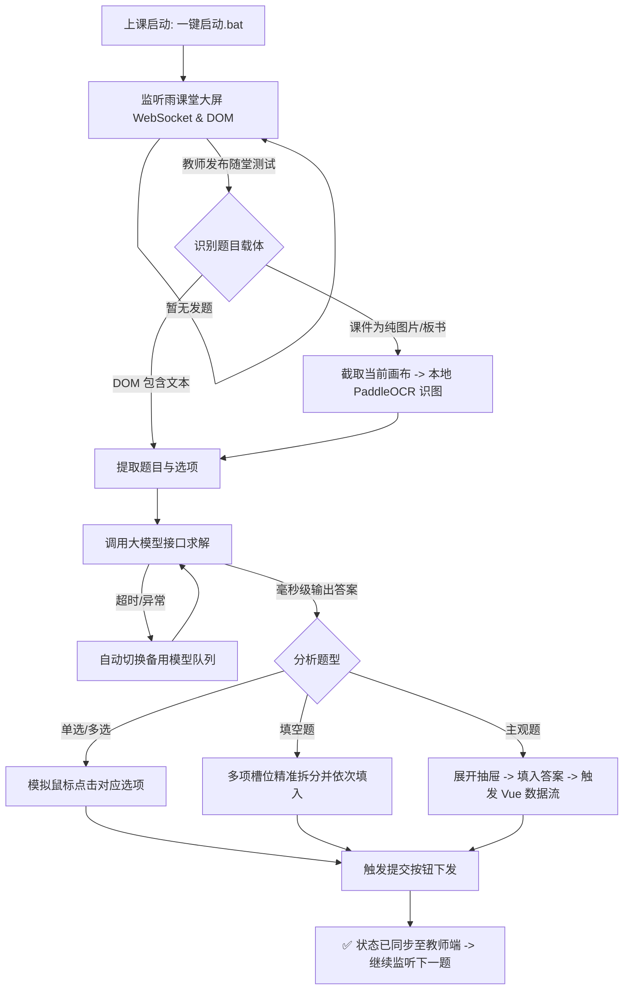

# 🎓 雨课堂全自动随堂测验助手 (Rain Classroom Auto Quiz Solver)

<p align="center">
  
  
  
  
  
</p>

> **专为高校学生打造的随堂互动无感全自动作答系统。**  
> 无论是听课走神、专心记笔记还是短暂离席，均可由本地 AI 引擎实时静默值守，毫秒级捕获随堂测试并自动完成精准解答与提交。

---

## 📌 适用平台与版本明确说明 (Platform & Scope)

> [!IMPORTANT]
> **请务必在运行前确认您所在学校的雨课堂网页端版本与访问域名：**
>
> 1. **核心原生适配平台**：
>    - **雨课堂官方标准通用版**：`https://www.yuketang.cn`
>    - **网页学生端登录入口**：`https://www.yuketang.cn/v2/web/index`
>    - **作答大屏核心交互页**：`https://www.yuketang.cn/lesson/fullscreen/v3/{lesson_id}`
>    - 全国绝大多数普通高校、采用**微信扫码登录**的标准雨课堂 V2/V3 网页体系均能完美无感开箱即用。
>
> 2. **关于高校定制/专有云版本（如长江雨课堂、荷塘雨课堂等）**：
>    - 部分高校（如清华、武大、华科等）部署了高校专属二级域名（如 `changjiang.yuketang.cn`、`pro.yuketang.cn` 或各校独立子域）。
>    - 本项目现已支持在 `config.json` 中自定义配置 `"yuketang_base_url": "https://你的高校雨课堂域名"`。
>    - **注意**：部分专有云版本采用了强绑定的**统一身份认证单点登录 (SSO / 学工号密码)** 或不同的内部组件路由，若在扫码或大屏监听时遇到差异，欢迎提交 [Issues](https://github.com/jxylisty/yuketang-auto-answer/issues) 共同适配！

---

## ✨ 核心特性

- 🎯 **全题型深度覆盖**：
  - **单选题**：自动定位选项按钮并点击提交。
  - **多选题**：支持任意多项组合，多键齐选并自动提交。
  - **多项填空题**：智能解析题目多个填空槽位（如 `1+1=[填空1]`, `1+2=[填空2]`），各空内容按序独立精准注入，彻底告别“全空填一样”的尴尬。
  - **主观/简答题**：自动展开作答侧边抽屉，针对性生成学术要点并触发底层 Vue 双向数据绑定提交。
- 🧠 **DOM 树解析 + 本地 PaddleOCR 双引擎**：
  - 优先嗅探雨课堂大屏 DOM 文本与题目元数据。
  - 教师端直接上传纯图片课件或手写板书时，自动唤起本地轻量级 **PaddleOCR** 进行文字识别，识图答题毫无死角。
- ⚡ **国内网络秒通，无需翻墙**：
  - 完美支持国内主流 OpenAI 兼容格式服务商（如 TokenRhythm、硅基流动、DeepSeek 官方等），平均出解耗时 **2~4 秒**。
- 🛡️ **多模型自动故障转移 (Failover)**：
  - 内置模型容灾池（默认 `DeepSeek -> GLM-5 -> Qwen`）。若遇网络波动或高峰队列超时，系统自动秒级切换备用模型重试，绝不漏题。
- 🔒 **本地私密 Session 隔离**：
  - 采用独立的浏览器会话目录 (`edge_profile`)，仅保存在用户本地，微信登录态一次扫码永久有效。
  - 代码全面脱敏，敏感 API Key 与登录数据绝不上云。
- 🖱️ **开箱即用，双击运行**：
  - 纯 Python 独立运行，无需常驻任何复杂 IDE 或臃肿客户端。配置好后，上课前双击批处理文件即可静默值守。

---

## 👁️ 多模态视觉 (Vision) vs 纯文字 OCR 模式说明

> [!IMPORTANT]
> **关于图表题、电路题、几何题等【非文字视觉题】的解决机制：**
>
> 1. **纯文字 + 本地 PaddleOCR 模式（默认模式）**：
>    - **适用场景**：绝大多数以文字描述为主的概念单选题、多选题、填空题与简答题。
>    - **客观局限**：如果老师发布的题目包含**电路分析图、几何作图、物理受力图、函数曲线、流程图或结构连线**等【非文字图表】，纯 OCR 只能识别出零碎的字母和数字（如 `R1`, `C`, `A`, `B`），大模型无法感知图形的空间关系与连线逻辑。
>
> 2. **多模态视觉 (Vision) 模式（进阶看图解题）**：
>    - **核心优势**：系统会自动将大屏课件截图直接编码并上传给视觉大模型（如 `qwen-vl` / `glm-4v` / `gpt-4o` 等）。AI 拥有“人类般的视觉眼眸”，直接看图理解电路走向与几何关系，轻松秒解图表类难题！
>    - **极速开启**：在 `config.json` 中设置 `"enable_multimodal": true` 并指定你的视觉模型即可开启。

---

## 🏗️ 运行流程架构



---

## 🚀 极速上手指南 (3步即可运行)

### 1. 准备运行环境与代码
确保电脑已安装 Python 3.8+，克隆或下载本项目到本地，在项目根目录打开终端执行：
```bash
# 克隆仓库并进入目录
git clone https://github.com/jxylisty/yuketang-auto-answer.git
cd yuketang-auto-answer

# 推荐使用清华大学镜像源极速下载依赖
pip install -r requirements.txt -i https://pypi.tuna.tsinghua.edu.cn/simple
```

### 2. 首次扫码登录
在项目根目录中，双击运行 **`首次使用(扫码登录).bat`**（或执行 `python login_helper.py`）：
1. 系统会自动拉起 Edge 专用浏览器并打开雨课堂。
2. 使用手机**微信扫码登录**雨课堂。
3. 扫码成功进入主页后，窗口会自动关闭，登录态已持久化保存。后续上课无需重复扫码！

### 3. 配置 API Key 并启动
1. 复制根目录下的 `config.example.json`，重命名为 **`config.json`**。
2. 打开 `config.json`，填入你的 API Key（例如 TokenRhythm、DeepSeek 官方或各大聚合平台密钥）：
```json
{
  "api_base": "https://tokenrhythm.studio/v1",
  "api_key": "sk_tr_xxxxxxxxxxxxxxxxxxxxxx",
  "models": [
    "deepseek-v4-flash-0731",
    "glm-5.3-flash",
    "qwen3.7-flash"
  ],
  "enable_multimodal": false,
  "multimodal_models": [
    "qwen-vl-plus",
    "glm-4v-flash"
  ],
  "yuketang_base_url": "https://www.yuketang.cn",
  "auto_submit": true,
  "headless": false,
  "listen_interval": 1.0
}
```
3. 上课前，直接双击运行 **`一键启动(全自动答题).bat`**（或 `start.bat`）！  
   终端将静默监听当前进行中的课堂，一旦老师发题，几秒内即刻完成全自动作答！

---

## ⚙️ 配置文件参数说明 (`config.json`)

| 配置项 | 类型 | 默认值 | 作用说明 |
| :--- | :---: | :--- | :--- |
| `yuketang_base_url` | string | `https://www.yuketang.cn` | 雨课堂主站域名（各校专有二级域名在此调整） |
| `api_base` | string | `https://tokenrhythm.studio/v1` | 兼容 OpenAI 格式的 API 请求基址 |
| `api_key` | string | `""` | 你的大模型接口 API Key（必填） |
| `models` | array | `["deepseek-v4-flash-0731", ...]` | 纯文本模型灾备池，按从前到后优先级依次尝试 |
| `enable_multimodal` | bool | `false` | 是否开启多模态视觉看图解题（解决电路/几何等非文字题） |
| `multimodal_models` | array | `["qwen-vl-plus", "glm-4v-flash"]` | 多模态视觉模型队列，开启后自动将题目截图发送给视觉模型 |
| `auto_submit` | bool | `true` | 是否在做完题后自动点击最终提交按钮 |
| `headless` | bool | `false` | 是否开启无头模式（静默后台运行，不弹出浏览器界面） |
| `listen_interval` | float | `1.0` | 课堂状态轮询监听间隔（秒） |

> **💡 上课挂机防踩坑须知**：
> - **切勿合盖休眠**：Windows 笔记本在合上屏幕时会自动进入“休眠模式（Sleep）”，CPU 与 Wi-Fi 将被彻底掐断。**请务必在到达教室、开机连上校园网/热点后再启动程序**！
> - **切勿手动关闭 Edge**：自动拉起的 Edge 浏览器是操作核心载体，**可以最小化至后台，但切勿点击右上角 X 关闭**。（程序已内置自动重连与自愈保护，即使误关也会自动重新拉起）。

> **💡 免费/高性价比 API 推荐**：
> - **TokenRhythm**：支持高并发极速 Flash 模型，注册赠送额度。
> - **硅基流动 (SiliconFlow)**：提供免费或极低成本的 DeepSeek-V3 / Qwen 接口。
> - **DeepSeek 官方平台**：直接调用官方 `api.deepseek.com`。

---

## 📂 仓库目录结构

```text
yuketang-auto-answer/
├── .gitignore                    # Git 忽略名单 (保护个人 Session 与隐私密钥)
├── README.md                     # 项目中文说明文档
├── LICENSE                       # MIT 开源授权协议
├── requirements.txt              # 项目 Python 依赖声明
├── config.example.json           # 配置模板参考
├── config.json                   # 用户本地配置 (已忽略上传，安全私密)
│
├── ykt_standalone_agent.py       # 核心自动化引擎主程序
├── login_helper.py               # 首次扫码登录辅助脚本
│
├── 一键启动(全自动答题).bat        # Windows 快捷启动入口
├── 首次使用(扫码登录).bat          # Windows 首次登录入口
├── start.bat / login.bat         # 纯英命名的快捷批处理别名
│
├── tampermonkey/                 # 网页版油猴脚本备用方案
│   └── yuketang-auto-answer.user.js
│
└── archive/                      # 历史测试与开发探针归档 (不影响日常运行)
    ├── debug_tools/              # 历史逆向测试脚本
    └── debug_screenshots/        # 历史排查截图
```

---

## ❓ 常见问题解答 (FAQ)

<details>
<summary><b>Q1: 运行时报错找不到 Edge 驱动 (msedgedriver)？</b></summary>
Selenium 4.15+ 已原生内置 <code>Selenium Manager</code>，会自动匹配系统当前安装的 Edge 浏览器版本并在线加载对应驱动。确保你的机器能正常访问互联网即可，通常无需手动下载任何驱动文件。
</details>

<details>
<summary><b>Q2: 首次运行时 PaddleOCR 提示下载模型慢怎么办？</b></summary>
初次运行识别图片时，PaddleOCR 会自动下载官方轻量级中英文模型（约 15MB）至本地缓存目录。该过程仅在第一次使用时触发一次，后续均在本地零延迟秒启。如果高校网络较慢，可开启热点重试。
</details>

<details>
<summary><b>Q3: 会被雨课堂或教师端察觉为机器作答吗？</b></summary>
本系统模拟真实人类作答行为：
1. 采用真实的独立桌面版浏览器，带有完整的渲染树和真实的 Vue 事件分发机制。
2. 答题时模拟了拟真键盘输入与元素聚焦过程（<code>focus -> input -> change -> keyup</code>）。
3. 教师端后台查看到的数据包与正常学生浏览器提交的答卷完全一致。
</details>

<details>
<summary><b>Q4: 为什么要做多模型故障转移 (Failover)？</b></summary>
随堂测试通常只有短短 1~2 分钟答题时间。若单一模型由于服务器拥堵产生超时（Read Timeout），系统会自动在 9 秒内快速降级到第二个候选模型，确保在倒计时结束前稳稳提交答案。
</details>

---

## ⚖️ 免责声明 (Disclaimer)

1. 本项目开源仅用于**个人学习交流、Python 自动化控制技术以及大模型实践探索**。
2. 请合理、合规使用本工具。使用者应当遵守所在院校的相关学术诚信规范和课堂纪律，切勿用于期末正规考试或违规刷分等不正当行为。
3. 因违规使用本工具造成的一切后果和责任，均由使用者本人承担，项目开发者不承担任何连带责任。
